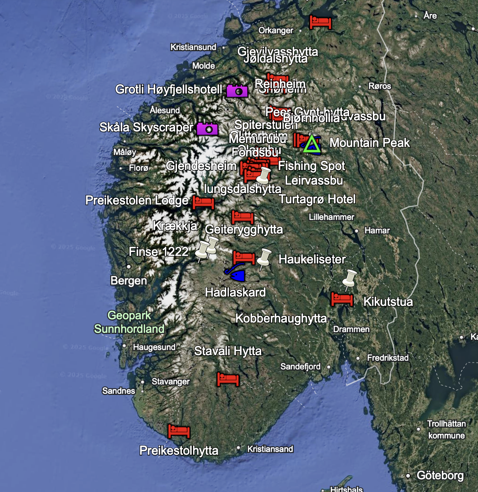

# GPX POI Management Tool


*Example: DNT cabins and trails visualized in Google Earth using the KML export feature*


A powerful Python command-line tool for managing Points of Interest (POI) in GPX files for Garmin GPS devices and Google Earth. This tool helps you build and maintain a master collection of POIs by importing from multiple GPX files, automatically handling duplicates, and exporting to various formats including KML for Google Earth visualization.

## ✨ Key Features

### 📍 **POI Management**
- **Import POIs**: Add POIs from GPX and FIT files to your master collection
- **Multi-file Import**: Process multiple files at once using wildcards (`*.gpx`, `*.fit`)
- **FIT File Support**: Extract waypoints and course points from Garmin FIT files
- **Duplicate Detection**: Automatically detects duplicates based on:
  - Exact name matches (case-insensitive)
  - Geographic proximity (configurable distance threshold, default 50m)
- **Smart Merging**: When duplicates are found, combines the best information from both POIs
- **Deduplication**: Remove duplicates from existing GPX files

### 🔧 **Advanced Features**
- **Elevation Lookup**: Automatically fetch elevation data using online services
- **Garmin Optimization**: Optimize files specifically for Garmin GPS devices
- **Symbol Assignment**: Add appropriate Garmin-compatible symbols based on POI type

### 📤 **Export Options**
- **GPX Output**: Standard GPX 1.1 format for GPS devices
- **KML Export**: Rich Google Earth files with organized folders and custom icons
- **Garmin CSV**: BaseCamp-compatible format for easy import

## 🌍 **Google Earth Integration Example**

Transform your GPX collection into a beautiful Google Earth visualization:

```bash
# Export your DNT cabin collection to Google Earth
python3 poi-tool.py -t gpx/dnt-cabins-norway.gpx --export-kml cabins-google-earth.kml
```

**Result**: A professionally organized KML file with:
- 🏠 **DNT Cabins & Lodges** (red lodge icons)
- 🏔️ **Mountain Peaks** (green triangle icons)
- 🎣 **Fishing Spots** (blue fishing icons)
- 📷 **Scenic Areas** (magenta camera icons)
- 🏖️ **Beaches** (yellow beach icons)

Each POI includes rich information balloons with descriptions, coordinates, elevation data, and clickable links.

> 💡 **Try it yourself**: Download [example-google-earth.kml](example-google-earth.kml) and open it in Google Earth to see the DNT cabin collection in action!

## 🚀 **Quick Start for New Users**

### 1. **Get Started (Choose Your Approach)**

**🚀 Simple Setup (Recommended for most users)**
```bash
# Install the only required package
pip3 install --user requests

# You're ready to use the tool!
python3 poi-tool.py -t gpx/master-collection.gpx --export-kml my-pois.kml
```

**🔧 Advanced Setup (For developers)**
```bash
# Set up isolated environment (optional but recommended for development)
python3 -m venv venv
source venv/bin/activate  # On macOS/Linux
pip install -r requirements.txt
```

### 2. **Try It Out with Sample Data**
```bash
# Import all GPX and FIT files to create your master collection
python3 poi-tool.py -t gpx/master-poi-collection.gpx -a "gpx/*.gpx" -v

# Add waypoints from a Garmin FIT file (e.g., from a cycling route)
python3 poi-tool.py -t gpx/master-poi-collection.gpx -a "activities/route.fit" -v

# Export to Google Earth for visualization
python3 poi-tool.py -t gpx/master-poi-collection.gpx --export-kml my-pois.kml

# Export to Garmin BaseCamp format
python3 poi-tool.py -t gpx/master-poi-collection.gpx --export-garmin-poi my-pois.csv
```

### 3. **Enhance Your Collection**
```bash
# Add elevation data and Garmin symbols, then optimize
python3 poi-tool.py -t gpx/master-poi-collection.gpx --elevation-lookup --add-waypoint-symbols --garmin-optimize -v
```

**Result**: You now have a professional POI collection ready for both Garmin GPS devices and Google Earth! 🎯

---

## 📊 **Workflow Overview**

```
📂 Individual GPX files    →   🔄 poi-tool.py   →   📍 Master Collection
   ├── cabin1.gpx                    ├── Import         ├── master-collection.gpx
   ├── cabin2.gpx                    ├── Deduplicate    ├── master-collection.garmin.gpx
   ├── trails.gpx                    ├── Enhance        ├── master-collection.kml
   └── peaks.gpx                     └── Export         └── master-collection.csv
                                                                  ↓
                                                          🗺️ Ready for GPS & Google Earth
```

## Installation

### Requirements
- Python 3.6 or higher
- `requests` library (for elevation lookup feature)
- `fitparse` library (for FIT file support - optional)

### Quick Start
```bash
# Install required libraries
pip3 install --user requests fitparse

# That's it! Start using the tool
python3 poi-tool.py --help
```

### Alternative: Virtual Environment (Optional)
If you prefer isolated environments or work with many Python projects:
```bash
python3 -m venv venv
source venv/bin/activate  # On macOS/Linux
pip install -r requirements.txt
```

> 💡 **Note**: Virtual environments are optional for this tool since it has only one dependency.

## Usage

### Basic Commands

```bash
# Add POIs from a single source file to your master collection
python3 poi-tool.py -t master-poi-collection.gpx -a new-poi-file.gpx

# Add POIs from ALL GPX files in the current directory (excluding the target file)
python3 poi-tool.py -t master-poi-collection.gpx -a "*.gpx"

# Add POIs from multiple specific files
python3 poi-tool.py -t master-poi-collection.gpx -a file1.gpx file2.gpx file3.gpx

# Remove duplicates from your master collection
python3 poi-tool.py -t master-poi-collection.gpx --dedupe

# Verbose output to see what's happening
python3 poi-tool.py -t master-poi-collection.gpx -a new-poi-file.gpx -v
```

### Command Line Options

- `-t, --target TARGET`: Target GPX file (your master POI collection) - **Required**
- `-a, --add ADD [ADD ...]`: GPX file(s) or pattern to import POIs from
  - Single file: `-a cabin.gpx`
  - Multiple files: `-a cabin1.gpx cabin2.gpx cabin3.gpx`
  - Wildcard pattern: `-a "*.gpx"` (processes all GPX files, excluding the target)
- `--dedupe`: Remove duplicates from the target file
- `--distance-threshold DISTANCE`: Distance threshold in meters for duplicate detection (default: 50.0)

- `--elevation-lookup`: Automatically add elevation data using online services
- `--add-waypoint-symbols`: Add Garmin-compatible symbols/icons to waypoints
- `--garmin-optimize`: Optimize GPX file structure for Garmin devices
- `--export-garmin-poi FILE.csv`: Export to Garmin POI CSV format for BaseCamp
- `--export-kml FILE.kml`: Export to KML format for Google Earth
- `-v, --verbose`: Enable detailed output
- `-h, --help`: Show help message

### Examples

```bash
# Import POIs from a single hiking trail file
python3 poi-tool.py -t master-poi-collection.gpx -a hiking-trails.gpx

# Import ALL GPX files from current directory (wildcard pattern)
python3 poi-tool.py -t master-poi-collection.gpx -a "*.gpx"

# Import from multiple specific files
python3 poi-tool.py -t master-poi-collection.gpx -a cabins.gpx trails.gpx peaks.gpx

# Import with verbose output to see processing details
python3 poi-tool.py -t master-poi-collection.gpx -a "*.gpx" -v

# Clean up duplicates in your collection
python3 poi-tool.py -t master-poi-collection.gpx --dedupe

# Use custom distance threshold (100 meters instead of default 50)
python3 poi-tool.py -t master-poi-collection.gpx -a mountain-peaks.gpx --distance-threshold 100.0

# Export to different formats
python3 poi-tool.py -t master-poi-collection.gpx --export-kml google-earth.kml
python3 poi-tool.py -t master-poi-collection.gpx --export-garmin-poi garmin-basecamp.csv
```

## How Duplicate Detection Works

The tool identifies duplicates using two methods:

1. **Name Matching**: POIs with identical names (case-insensitive) are considered duplicates
2. **Geographic Proximity**: POIs within a specified distance (default 50 meters) are considered duplicates

When duplicates are found, the tool intelligently merges them by:
- Keeping the longer, more descriptive name
- Preserving the more detailed description
- Using elevation data when available
- Averaging coordinates or using the more precise location

## File Format

The tool works with standard GPX 1.1 format files and outputs properly formatted files compatible with:

- Garmin GPS devices
- Most mapping software
- GPX standard specifications
- Google Earth (via KML export)
- Garmin BaseCamp (via CSV export)

## Export Formats

### KML for Google Earth
The `--export-kml` feature creates KML files optimized for Google Earth with:
- **Organized folders** by POI type (DNT Cabins, Mountain Peaks, Fishing Spots, etc.)
- **Custom icons** and colors for different POI categories
- **Rich descriptions** with elevation data, coordinates, and clickable links
- **3D visualization** support with elevation data

### Garmin POI CSV
The `--export-garmin-poi` feature creates CSV files for Garmin BaseCamp with:
- **BaseCamp compatibility** for easy import
- **Symbol assignments** based on POI type
- **Complete metadata** including coordinates, elevation, and descriptions

## Example Workflow

```bash
# Start with an empty master collection
python3 poi-tool.py -t master-poi-collection.gpx -a cabin1.gpx

# Add more POIs from different sources
python3 poi-tool.py -t master-poi-collection.gpx -a cabin2.gpx
python3 poi-tool.py -t master-poi-collection.gpx -a hiking-waypoints.gpx
python3 poi-tool.py -t master-poi-collection.gpx -a fishing-spots.gpx

# Clean up any duplicates that might have been introduced
python3 poi-tool.py -t master-poi-collection.gpx --dedupe

# Your master-poi-collection.gpx now contains all unique POIs!
```
